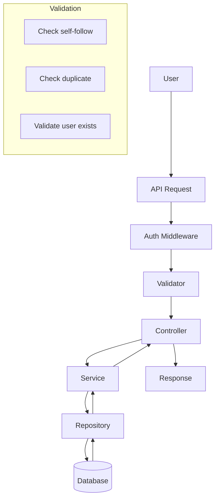
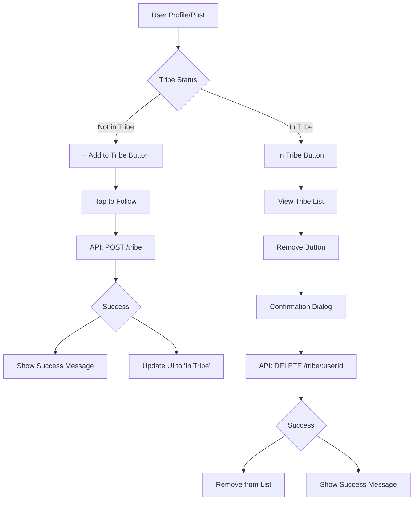
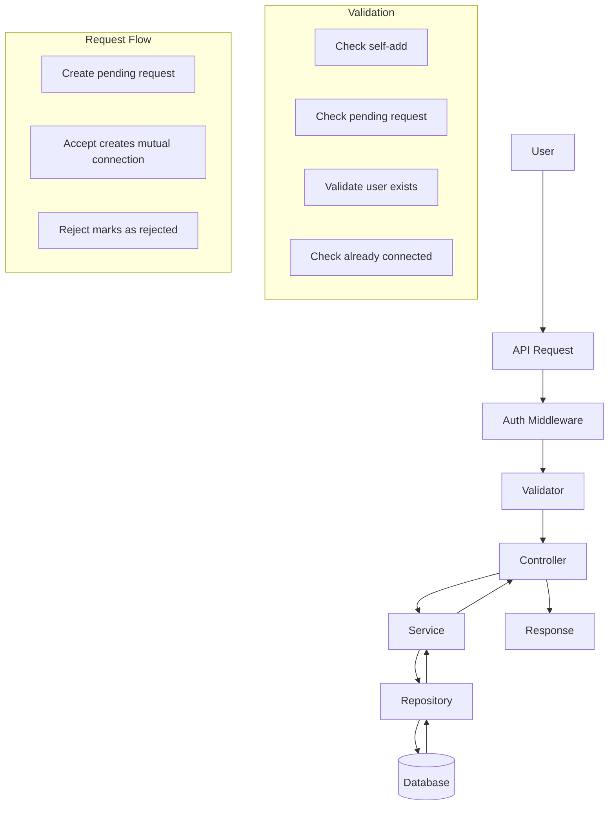

# Tribe Feature Implementation Guide

## Overview

The Tribe feature allows users to follow other users in a one-way relationship, similar to Twitter's follow system. Users can add others to their Tribe (following), remove them (unfollowing), and view their Tribe members. This feature will be implemented as an extension of the existing `profiles` module.

**Important Distinction**: Tribe is a **one-way relationship**. If User A adds User B to their Tribe, User B does not automatically add User A. This is different from Circle, which requires acceptance from the other user.

## Feature Requirements

### Core Capabilities
1. **Add to Tribe** - Users can follow others via profiles, posts, or search results
2. **Remove from Tribe** - Users can unfollow directly from their Tribe list
3. **List Management** - Tribe list is accessible from the user's profile
4. **Rules & Validation** - Prevent self-following, duplicate entries, with confirmation for unfollowing

### User Stories

**As a logged-in user,**  
I want to add people to my Tribe and remove them when needed,  
so that I can build and maintain a trusted network of users I'm connected with inside the app.

### Acceptance Criteria

#### Add to Tribe
- User can add another user to their Tribe by tapping a "+ Add to Tribe" button on a user's profile or post
- After adding:
  - The added user appears in the Tribe member list
  - A success message is shown: "User added to your Tribe"
  - Optional: Request approval before finalizing (for invite-based models)

#### Remove from Tribe
- User can remove someone from their Tribe by navigating to the Tribe list and tapping "Remove" on a member
- Upon confirmation:
  - The member is removed from the list
  - The UI updates immediately and a success message is shown

#### Validation
- Users cannot add themselves to their own Tribe
- Users cannot add someone already in their Tribe (button is disabled or changes to "In Tribe")

## API Endpoints

| Method | Endpoint | Description |
|--------|----------|-------------|
| POST | `/profiles/tribe` | Add user to Tribe (follow) |
| DELETE | `/profiles/tribe/:userId` | Remove user from Tribe (unfollow) |
| GET | `/profiles/tribe` | Get Tribe members list |
| GET | `/profiles/tribe/count` | Get Tribe members count |
| GET | `/profiles/tribe/is-member/:userId` | Check if user is in Tribe |

## Database Schema

### New Table: user_follows
```sql
CREATE TABLE IF NOT EXISTS user_follows (
  id VARCHAR PRIMARY KEY DEFAULT LOWER(CAST(uuid_generate_v1mc() As VARCHAR(50))),
  follower_id VARCHAR NOT NULL REFERENCES users(id) ON DELETE CASCADE,
  following_id VARCHAR NOT NULL REFERENCES users(id) ON DELETE CASCADE,
  created_at TIMESTAMPTZ DEFAULT NOW(),
  UNIQUE(follower_id, following_id)
);

-- Indexes
CREATE INDEX idx_user_follows_follower_id ON user_follows(follower_id);
CREATE INDEX idx_user_follows_following_id ON user_follows(following_id);
CREATE INDEX idx_user_follows_created_at ON user_follows(created_at DESC);
```

## File Structure Changes

### New Files
- `migrations/sqls/YYYYMMDDHHMMSS-add-tribe-table-up.sql`
- `migrations/sqls/YYYYMMDDHHMMSS-add-tribe-table-down.sql`

### Updated Files
- `src/modules/profiles/entities.ts` - Add `UserFollowEntity`
- `src/modules/profiles/dto.ts` - Add DTOs for Tribe operations
- `src/modules/profiles/validator.ts` - Add validation schemas
- `src/modules/profiles/query.ts` - Add SQL queries
- `src/modules/profiles/interface.ts` - Add interface methods
- `src/modules/profiles/services.ts` - Add service methods
- `src/modules/profiles/controller.ts` - Add controller methods
- `src/modules/profiles/routes.ts` - Add new routes
- `src/modules/profiles/repositories.ts` - Add repository methods

## Implementation Steps

### Step 1: Database Migration
1. Create new migration files for `user_follows` table
2. Create appropriate indexes

### Step 2: Entity Layer
```typescript
// src/modules/profiles/entities.ts (additions)
export class UserFollowEntity extends BaseEntity<UserFollowEntity> {
  id?: string;
  follower_id?: string;
  following_id?: string;
  created_at?: Date;
}

export class TribeMemberEntity extends BaseEntity<TribeMemberEntity> {
  id?: string;
  username?: string;
  avatar?: string;
  followed_at?: Date;
}
```

### Step 3: DTO Layer
```typescript
// src/modules/profiles/dto.ts (additions)
export class AddToTribeDTO extends BaseEntity<AddToTribeDTO> {
  following_id: string;
}

export class GetTribeMembersDTO extends BaseEntity<GetTribeMembersDTO> {
  user_id: string;
  limit?: number;
  offset?: number;
}

export class RemoveFromTribeDTO extends BaseEntity<RemoveFromTribeDTO> {
  following_id: string;
}
```

### Step 4: Validator Layer
```typescript
// src/modules/profiles/validator.ts (additions)
export const addToTribeValidator = Joi.object({
  following_id: Joi.string().required(),
});

export const getTribeMembersValidator = Joi.object({
  limit: Joi.number().min(1).max(100).optional().default(20),
  offset: Joi.number().min(0).optional().default(0),
});

export const unfollowValidator = Joi.object({
  confirm: Joi.boolean().optional().default(false),
});
```

### Step 5: Query Layer
```typescript
// src/modules/profiles/query.ts (additions)
export default {
  // Add to Tribe (follow)
  addToTribe: `
    INSERT INTO user_follows (follower_id, following_id)
    VALUES ($1, $2)
    ON CONFLICT (follower_id, following_id) DO NOTHING
    RETURNING *;
  `,

  // Remove from Tribe (unfollow)
  removeFromTribe: `
    DELETE FROM user_follows
    WHERE follower_id = $1 AND following_id = $2;
  `,

  // Get Tribe members
  getTribeMembers: `
    SELECT u.id, u.username, u.avatar, uf.created_at as followed_at
    FROM user_follows uf
    JOIN users u ON uf.following_id = u.id
    WHERE uf.follower_id = $1
    ORDER BY uf.created_at DESC
    LIMIT $2 OFFSET $3;
  `,

  // Get Tribe count
  getTribeCount: `
    SELECT COUNT(*) as total FROM user_follows
    WHERE follower_id = $1;
  `,

  // Check if user is in Tribe
  isInTribe: `
    SELECT EXISTS(
      SELECT 1 FROM user_follows
      WHERE follower_id = $1 AND following_id = $2
    );
  `,

  // Get follower count (users who follow this user)
  getFollowerCount: `
    SELECT COUNT(*) as total FROM user_follows
    WHERE following_id = $1;
  `,
};
```

### Step 6: Interface Layer
```typescript
// src/modules/profiles/interface.ts (additions)
export interface ProfilesInterface {
  // Existing methods...

  // Tribe methods
  addToTribe(payload: AddToTribeDTO): Promise<BadException | UserFollowEntity>;
  removeFromTribe(payload: RemoveFromTribeDTO): Promise<BadException | void>;
  getTribeMembers(payload: GetTribeMembersDTO): Promise<BadException | TribeMemberEntity[]>;
  getTribeCount(userId: string): Promise<BadException | number>;
  isInTribe(userId: string, followingId: string): Promise<BadException | boolean>;
  getFollowerCount(userId: string): Promise<BadException | number>;
}
```

### Step 7: Repository Layer
- Implement all methods defined in interface
- Use `db.tx()` for transactional operations
- Handle duplicate entries gracefully
- Return appropriate exceptions

### Step 8: Service Layer
```typescript
// src/modules/profiles/services.ts (additions)
export class ProfilesServiceImpl implements ProfilesInterface {
  // Existing methods...

  public addToTribe = async (
    payload: AddToTribeDTO
  ): Promise<BadException | UserFollowEntity> => {
    // Validate user is not trying to follow themselves
    if (payload.user_id === payload.following_id) {
      return new BadException('You cannot follow yourself');
    }

    // Validate following user exists
    const userExists = await ProfilesRepository.checkUserExists(payload.following_id);
    if (!userExists) {
      return new NotFoundException('User not found');
    }

    return await ProfilesRepository.addToTribe(payload);
  };

  public removeFromTribe = async (
    payload: RemoveFromTribeDTO
  ): Promise<BadException | void> => {
    return await ProfilesRepository.removeFromTribe(payload);
  };

  public getTribeMembers = async (
    payload: GetTribeMembersDTO
  ): Promise<BadException | TribeMemberEntity[]> => {
    return await ProfilesRepository.getTribeMembers(payload);
  };

  public getTribeCount = async (
    userId: string
  ): Promise<BadException | number> => {
    return await ProfilesRepository.getTribeCount(userId);
  };

  public isInTribe = async (
    userId: string,
    followingId: string
  ): Promise<BadException | boolean> => {
    return await ProfilesRepository.isInTribe(userId, followingId);
  };

  public getFollowerCount = async (
    userId: string
  ): Promise<BadException | number> => {
    return await ProfilesRepository.getFollowerCount(userId);
  };
}
```

### Step 9: Controller Layer
```typescript
// src/modules/profiles/controller.ts (additions)
export class ProfilesController {
  // Existing methods...

  public addToTribe: fnRequest = async (req: AuthenticatedRequest, res) => {
    const payload = new AddToTribeDTO();
    payload.user_id = req.user?.id as string;
    payload.following_id = req.body.following_id;

    const response = await ProfilesService.addToTribe(payload);

    if (response instanceof BadException) {
      logger.error(response.message, 'profiles.controller.ts');
      return ResponseBuilder.error(res, response, response.code);
    }

    logger.info('User added to Tribe successfully', 'profiles.controller.ts');
    return ResponseBuilder.success(res, 'Added to Tribe successfully', StatusCodes.CREATED, response);
  };

  public removeFromTribe: fnRequest = async (req: AuthenticatedRequest, res) => {
    const payload = new RemoveFromTribeDTO();
    payload.user_id = req.user?.id as string;
    payload.following_id = req.params.userId;

    const response = await ProfilesService.removeFromTribe(payload);

    if (response instanceof BadException) {
      logger.error(response.message, 'profiles.controller.ts');
      return ResponseBuilder.error(res, response, response.code);
    }

    logger.info('User removed from Tribe successfully', 'profiles.controller.ts');
    return ResponseBuilder.success(res, 'Removed from Tribe successfully', StatusCodes.OK, response);
  };

  public getTribeMembers: fnRequest = async (req: AuthenticatedRequest, res) => {
    const payload = new GetTribeMembersDTO();
    payload.user_id = req.user?.id as string;
    payload.limit = parseInt(req.query.limit as string) || 20;
    payload.offset = parseInt(req.query.offset as string) || 0;

    const response = await ProfilesService.getTribeMembers(payload);

    if (response instanceof BadException) {
      logger.error(response.message, 'profiles.controller.ts');
      return ResponseBuilder.error(res, response, response.code);
    }

    logger.info('Tribe members retrieved successfully', 'profiles.controller.ts');
    return ResponseBuilder.success(res, 'Tribe members retrieved', StatusCodes.OK, response);
  };

  public getTribeCount: fnRequest = async (req: AuthenticatedRequest, res) => {
    const userId = req.user?.id as string;
    const response = await ProfilesService.getTribeCount(userId);

    if (response instanceof BadException) {
      logger.error(response.message, 'profiles.controller.ts');
      return ResponseBuilder.error(res, response, response.code);
    }

    return ResponseBuilder.success(res, 'Tribe count retrieved', StatusCodes.OK, { count: response });
  };

  public isInTribe: fnRequest = async (req: AuthenticatedRequest, res) => {
    const userId = req.user?.id as string;
    const followingId = req.params.userId;
    const response = await ProfilesService.isInTribe(userId, followingId);

    if (response instanceof BadException) {
      logger.error(response.message, 'profiles.controller.ts');
      return ResponseBuilder.error(res, response, response.code);
    }

    return ResponseBuilder.success(res, 'Tribe membership checked', StatusCodes.OK, { is_in_tribe: response });
  };
}
```

### Step 10: Routes Layer
```typescript
// src/modules/profiles/routes.ts (additions)

/**
 * @swagger
 * /profiles/tribe:
 *   post:
 *     summary: Add user to Tribe (follow)
 *     tags: [Profiles]
 *     security:
 *       - bearerAuth: []
 *     requestBody:
 *       required: true
 *       content:
 *         application/json:
 *           schema:
 *             type: object
 *             properties:
 *               following_id:
 *                 type: string
 *                 description: ID of user to follow
 *     responses:
 *       201:
 *         description: User added to Tribe successfully
 *       400:
 *         description: Cannot follow yourself or already following
 */
profilesRouter.post(
  '/tribe',
  verifyAuth,
  validateDataMiddleware(addToTribeValidator, 'body'),
  WatchAsyncController(profilesController.addToTribe)
);

/**
 * @swagger
 * /profiles/tribe/{userId}:
 *   delete:
 *     summary: Remove user from Tribe (unfollow)
 *     tags: [Profiles]
 *     security:
 *       - bearerAuth: []
 *     parameters:
 *       - name: userId
 *         in: path
 *         required: true
 *         schema:
 *           type: string
 *     responses:
 *       200:
 *         description: User removed from Tribe successfully
 */
profilesRouter.delete(
  '/tribe/:userId',
  verifyAuth,
  WatchAsyncController(profilesController.removeFromTribe)
);

/**
 * @swagger
 * /profiles/tribe:
 *   get:
 *     summary: Get Tribe members list
 *     tags: [Profiles]
 *     security:
 *       - bearerAuth: []
 *     parameters:
 *       - name: limit
 *         in: query
 *         schema:
 *           type: number
 *           default: 20
 *       - name: offset
 *         in: query
 *         schema:
 *           type: number
 *           default: 0
 *     responses:
 *       200:
 *         description: Tribe members retrieved successfully
 */
profilesRouter.get(
  '/tribe',
  verifyAuth,
  validateDataMiddleware(getTribeMembersValidator, 'query'),
  WatchAsyncController(profilesController.getTribeMembers)
);

/**
 * @swagger
 * /profiles/tribe/count:
 *   get:
 *     summary: Get Tribe members count
 *     tags: [Profiles]
 *     security:
 *       - bearerAuth: []
 *     responses:
 *       200:
 *         description: Tribe count retrieved successfully
 */
profilesRouter.get(
  '/tribe/count',
  verifyAuth,
  WatchAsyncController(profilesController.getTribeCount)
);

/**
 * @swagger
 * /profiles/tribe/is-member/{userId}:
 *   get:
 *     summary: Check if user is in Tribe
 *     tags: [Profiles]
 *     security:
 *       - bearerAuth: []
 *     parameters:
 *       - name: userId
 *         in: path
 *         required: true
 *         schema:
 *           type: string
 *     responses:
 *       200:
 *         description: Tribe membership checked
 */
profilesRouter.get(
  '/tribe/is-member/:userId',
  verifyAuth,
  WatchAsyncController(profilesController.isInTribe)
);
```

## Validation Rules
1. **Self-following**: Users cannot follow themselves
2. **Duplicate entries**: Prevent duplicate entries with `ON CONFLICT` in SQL
3. **User existence**: Validate that the following user exists before following
4. **Confirmation**: Optional - require confirmation before unfollowing (via query param)

## Error Handling
| Error Code | Error Type | Scenario |
|------------|------------|----------|
| 400 | BadException | User trying to follow themselves |
| 400 | BadException | Invalid user ID format |
| 404 | NotFoundException | Following user does not exist |
| 409 | ConflictException | User already in Tribe |

## Mermaid Diagrams

### Data Flow Architecture


### User Experience Flow


## Testing Strategy

### Unit Tests
1. Service layer tests for business logic
2. Validator tests for input validation
3. Controller tests for request/response handling

### Integration Tests
1. Database operations
2. API endpoint responses
3. Auth middleware integration

## Comparison with Circle Feature

| Aspect | Tribe | Circle |
|--------|-------|--------|
| Relationship Type | One-way (following) | Two-way (requires acceptance) |
| Use Case | Twitter-like follow | Friend connections |
| Database Table | `user_follows` | `user_connections` |
| API Endpoints | `/profiles/tribe/*` | `/profiles/circle/*` |
| Validation | Prevent self-follow | Prevent self-request |
| Flow | Immediate | Request -> Accept -> Connection |
| UI Behavior | Follow/Unfollow | Send Request/Accept/Reject |

---

# Circle Feature Implementation Guide

## Overview

The Circle feature allows users to create mutual connections with other users, similar to Instagram's close friends feature. It's a two-way relationship where users need to accept connection requests. This feature will be implemented as an extension of the existing `profiles` module.

**Important Distinction**: Circle is a **two-way relationship with acceptance required**. If User A sends a Circle request to User B, User B must accept the request for the connection to be established. This is different from Tribe, which is a one-way relationship where you can follow others without them following you back, and different from an automatic mutual connection.

## Feature Requirements

### Core Capabilities
1. **Send Circle Request** - Users can send connection requests to others via profiles, posts, or search results
2. **Accept/Reject Circle Request** - Users can accept or reject incoming Circle requests
3. **Remove from Circle** - Users can remove others directly from their Circle list
4. **List Management** - Circle list is accessible from the user's profile
5. **Rules & Validation** - Prevent self-adding, duplicate entries

### User Stories

**As a logged-in user,**  
I want to add people to my Circle and remove them when needed,  
so that I can build a more personal or private space with selected users I engage with closely.

### Acceptance Criteria

#### Send Circle Request
- User can send a Circle request to another user by tapping a "+ Add to Circle" button on a profile, post, or search result
- After sending:
  - A success message is shown (e.g., "Circle request sent")
  - UI changes to show "Request Sent" status
  - The recipient receives a notification of the request

#### Accept Circle Request
- User receives a notification of incoming Circle request
- User can tap "Accept" to accept the request
- Upon acceptance:
  - Both users are now in each other's Circle
  - UI updates for both users
  - A success message is shown (e.g., "User added to your Circle")

#### Reject Circle Request
- User can tap "Reject" to decline the request
- Upon rejection:
  - No connection is established
  - The request is removed
  - The sender is notified (optional)

#### Remove from Circle
- User can remove someone by navigating to the Circle list and tapping "Remove"
- Upon confirmation:
  - Member is removed instantly
  - Circle count updates and a confirmation is shown
- The connection is removed for both users

#### Validation
- Users cannot send Circle requests to themselves
- Attempting to re-add someone already in your Circle is prevented
- Users cannot send multiple requests to the same user
- Users can add or remove without notifying the other party (after connection is established)

## API Endpoints

| Method | Endpoint | Description |
|--------|----------|-------------|
| POST | `/profiles/circle` | Send Circle request |
| PUT | `/profiles/circle/accept/:requestId` | Accept Circle request |
| PUT | `/profiles/circle/reject/:requestId` | Reject Circle request |
| DELETE | `/profiles/circle/:userId` | Remove user from Circle |
| GET | `/profiles/circle` | Get Circle members list |
| GET | `/profiles/circle/count` | Get Circle members count |
| GET | `/profiles/circle/is-member/:userId` | Check if user is in Circle |
| GET | `/profiles/circle/requests` | Get pending Circle requests |
| GET | `/profiles/circle/requests/sent` | Get sent Circle requests |

## Database Schema

### New Table: user_connections
```sql
CREATE TABLE IF NOT EXISTS user_connections (
  id VARCHAR PRIMARY KEY DEFAULT LOWER(CAST(uuid_generate_v1mc() As VARCHAR(50))),
  user_id VARCHAR NOT NULL REFERENCES users(id) ON DELETE CASCADE,
  connected_user_id VARCHAR NOT NULL REFERENCES users(id) ON DELETE CASCADE,
  status VARCHAR NOT NULL DEFAULT 'pending' CHECK (status IN ('pending', 'accepted', 'rejected')),
  created_at TIMESTAMPTZ DEFAULT NOW(),
  updated_at TIMESTAMPTZ DEFAULT NOW(),
  UNIQUE(user_id, connected_user_id)
);

-- Indexes
CREATE INDEX idx_user_connections_user_id ON user_connections(user_id);
CREATE INDEX idx_user_connections_connected_user_id ON user_connections(connected_user_id);
CREATE INDEX idx_user_connections_status ON user_connections(status);
CREATE INDEX idx_user_connections_created_at ON user_connections(created_at DESC);
```

## File Structure Changes

### New Files
- `migrations/sqls/YYYYMMDDHHMMSS-add-circle-table-up.sql`
- `migrations/sqls/YYYYMMDDHHMMSS-add-circle-table-down.sql`

### Updated Files
- `src/modules/profiles/entities.ts` - Add `UserConnectionEntity`
- `src/modules/profiles/dto.ts` - Add DTOs for Circle operations
- `src/modules/profiles/validator.ts` - Add validation schemas
- `src/modules/profiles/query.ts` - Add SQL queries
- `src/modules/profiles/interface.ts` - Add interface methods
- `src/modules/profiles/services.ts` - Add service methods
- `src/modules/profiles/controller.ts` - Add controller methods
- `src/modules/profiles/routes.ts` - Add new routes
- `src/modules/profiles/repositories.ts` - Add repository methods

## Implementation Steps

### Step 1: Database Migration
1. Create new migration files for `user_connections` table
2. Create appropriate indexes

### Step 2: Entity Layer
```typescript
// src/modules/profiles/entities.ts (additions)
export class UserConnectionEntity extends BaseEntity<UserConnectionEntity> {
  id?: string;
  user_id?: string;
  connected_user_id?: string;
  status?: 'pending' | 'accepted' | 'rejected';
  created_at?: Date;
  updated_at?: Date;
}

export class CircleRequestEntity extends BaseEntity<CircleRequestEntity> {
  id?: string;
  user_id?: string;
  connected_user_id?: string;
  status?: 'pending' | 'accepted' | 'rejected';
  created_at?: Date;
  updated_at?: Date;
}

export class CircleMemberEntity extends BaseEntity<CircleMemberEntity> {
  id?: string;
  username?: string;
  avatar?: string;
  connected_at?: Date;
}
```

### Step 3: DTO Layer
```typescript
// src/modules/profiles/dto.ts (additions)
export class SendCircleRequestDTO extends BaseEntity<SendCircleRequestDTO> {
  user_id: string;
  connected_user_id: string;
}

export class AcceptCircleRequestDTO extends BaseEntity<AcceptCircleRequestDTO> {
  user_id: string;
  request_id: string;
}

export class RejectCircleRequestDTO extends BaseEntity<RejectCircleRequestDTO> {
  user_id: string;
  request_id: string;
}

export class GetCircleMembersDTO extends BaseEntity<GetCircleMembersDTO> {
  user_id: string;
  limit?: number;
  offset?: number;
}

export class RemoveFromCircleDTO extends BaseEntity<RemoveFromCircleDTO> {
  user_id: string;
  connected_user_id: string;
}

export class GetCircleRequestsDTO extends BaseEntity<GetCircleRequestsDTO> {
  user_id: string;
}
```

### Step 4: Validator Layer
```typescript
// src/modules/profiles/validator.ts (additions)
export const sendCircleRequestValidator = Joi.object({
  connected_user_id: Joi.string().required(),
});

export const acceptCircleRequestValidator = Joi.object({
  request_id: Joi.string().required(),
});

export const rejectCircleRequestValidator = Joi.object({
  request_id: Joi.string().required(),
});

export const getCircleMembersValidator = Joi.object({
  limit: Joi.number().min(1).max(100).optional().default(20),
  offset: Joi.number().min(0).optional().default(0),
});
```

### Step 5: Query Layer
```typescript
// src/modules/profiles/query.ts (additions)
export default {
  // Send Circle request
  sendCircleRequest: `
    INSERT INTO user_connections (user_id, connected_user_id, status)
    VALUES ($1, $2, 'pending')
    ON CONFLICT (user_id, connected_user_id) DO NOTHING
    RETURNING *;
  `,

  // Accept Circle request (update status to accepted)
  acceptCircleRequest: `
    UPDATE user_connections
    SET status = 'accepted', updated_at = NOW()
    WHERE id = $1 AND connected_user_id = $2 AND status = 'pending'
    RETURNING *;
  `,

  // Create mutual connection after acceptance
  createMutualConnection: `
    INSERT INTO user_connections (user_id, connected_user_id, status)
    VALUES ($1, $2, 'accepted')
    ON CONFLICT (user_id, connected_user_id) DO NOTHING
    RETURNING *;
  `,

  // Reject Circle request
  rejectCircleRequest: `
    UPDATE user_connections
    SET status = 'rejected', updated_at = NOW()
    WHERE id = $1 AND connected_user_id = $2 AND status = 'pending'
    RETURNING *;
  `,

  // Remove from Circle
  removeFromCircle: `
    DELETE FROM user_connections
    WHERE (user_id = $1 AND connected_user_id = $2 AND status = 'accepted')
       OR (user_id = $2 AND connected_user_id = $1 AND status = 'accepted');
  `,

  // Get Circle members (only accepted connections)
  getCircleMembers: `
    SELECT u.id, u.username, u.avatar, uc.updated_at as connected_at
    FROM user_connections uc
    JOIN users u ON uc.connected_user_id = u.id
    WHERE uc.user_id = $1 AND uc.status = 'accepted'
    ORDER BY uc.updated_at DESC
    LIMIT $2 OFFSET $3;
  `,

  // Get Circle count
  getCircleCount: `
    SELECT COUNT(*) as total FROM user_connections
    WHERE user_id = $1 AND status = 'accepted';
  `,

  // Check if user is in Circle
  isInCircle: `
    SELECT EXISTS(
      SELECT 1 FROM user_connections
      WHERE user_id = $1 AND connected_user_id = $2 AND status = 'accepted'
    );
  `,

  // Get pending Circle requests (requests received by user)
  getPendingRequests: `
    SELECT uc.*, u.username, u.avatar
    FROM user_connections uc
    JOIN users u ON uc.user_id = u.id
    WHERE uc.connected_user_id = $1 AND uc.status = 'pending'
    ORDER BY uc.created_at DESC;
  `,

  // Get sent Circle requests
  getSentRequests: `
    SELECT uc.*, u.username, u.avatar
    FROM user_connections uc
    JOIN users u ON uc.connected_user_id = u.id
    WHERE uc.user_id = $1 AND uc.status = 'pending'
    ORDER BY uc.created_at DESC;
  `,

  // Check if there's a pending request
  hasPendingRequest: `
    SELECT EXISTS(
      SELECT 1 FROM user_connections
      WHERE (user_id = $1 AND connected_user_id = $2 AND status = 'pending')
         OR (user_id = $2 AND connected_user_id = $1 AND status = 'pending')
    );
  `,

  // Get request by ID
  getRequestById: `
    SELECT * FROM user_connections WHERE id = $1 AND connected_user_id = $2;
  `,
};
```

### Step 6: Interface Layer
```typescript
// src/modules/profiles/interface.ts (additions)
export interface ProfilesInterface {
  // Existing methods...

  // Circle methods
  sendCircleRequest(payload: SendCircleRequestDTO): Promise<BadException | CircleRequestEntity>;
  acceptCircleRequest(payload: AcceptCircleRequestDTO): Promise<BadException | UserConnectionEntity>;
  rejectCircleRequest(payload: RejectCircleRequestDTO): Promise<BadException | void>;
  removeFromCircle(payload: RemoveFromCircleDTO): Promise<BadException | void>;
  getCircleMembers(payload: GetCircleMembersDTO): Promise<BadException | CircleMemberEntity[]>;
  getCircleCount(userId: string): Promise<BadException | number>;
  isInCircle(userId: string, connectedUserId: string): Promise<BadException | boolean>;
  getPendingRequests(userId: string): Promise<BadException | CircleRequestEntity[]>;
  getSentRequests(userId: string): Promise<BadException | CircleRequestEntity[]>;
}
```

### Step 7: Repository Layer
- Implement all methods defined in interface
- Use `db.tx()` for transactional operations (inserting both directions for mutual connection)
- Handle duplicate entries gracefully
- Return appropriate exceptions

### Step 8: Service Layer
```typescript
// src/modules/profiles/services.ts (additions)
export class ProfilesServiceImpl implements ProfilesInterface {
  // Existing methods...

  public sendCircleRequest = async (
    payload: SendCircleRequestDTO
  ): Promise<BadException | CircleRequestEntity> => {
    // Validate user is not trying to add themselves
    if (payload.user_id === payload.connected_user_id) {
      return new BadException('You cannot send a Circle request to yourself');
    }

    // Validate connected user exists
    const userExists = await ProfilesRepository.checkUserExists(payload.connected_user_id);
    if (!userExists) {
      return new NotFoundException('User not found');
    }

    // Check if there's already a pending request
    const hasPending = await ProfilesRepository.hasPendingRequest(payload.user_id, payload.connected_user_id);
    if (hasPending) {
      return new ConflictException('A Circle request is already pending');
    }

    // Check if already connected
    const isConnected = await ProfilesRepository.isInCircle(payload.user_id, payload.connected_user_id);
    if (isConnected) {
      return new ConflictException('User is already in your Circle');
    }

    return await ProfilesRepository.sendCircleRequest(payload);
  };

  public acceptCircleRequest = async (
    payload: AcceptCircleRequestDTO
  ): Promise<BadException | UserConnectionEntity> => {
    // Get the request
    const request = await ProfilesRepository.getRequestById(payload.request_id, payload.user_id);
    if (!request) {
      return new NotFoundException('Circle request not found');
    }

    if (request.status !== 'pending') {
      return new BadException('This request has already been processed');
    }

    return await ProfilesRepository.acceptCircleRequest(payload);
  };

  public rejectCircleRequest = async (
    payload: RejectCircleRequestDTO
  ): Promise<BadException | void> => {
    // Get the request
    const request = await ProfilesRepository.getRequestById(payload.request_id, payload.user_id);
    if (!request) {
      return new NotFoundException('Circle request not found');
    }

    if (request.status !== 'pending') {
      return new BadException('This request has already been processed');
    }

    return await ProfilesRepository.rejectCircleRequest(payload);
  };

  public removeFromCircle = async (
    payload: RemoveFromCircleDTO
  ): Promise<BadException | void> => {
    return await ProfilesRepository.removeFromCircle(payload);
  };

  public getCircleMembers = async (
    payload: GetCircleMembersDTO
  ): Promise<BadException | CircleMemberEntity[]> => {
    return await ProfilesRepository.getCircleMembers(payload);
  };

  public getCircleCount = async (
    userId: string
  ): Promise<BadException | number> => {
    return await ProfilesRepository.getCircleCount(userId);
  };

  public isInCircle = async (
    userId: string,
    connectedUserId: string
  ): Promise<BadException | boolean> => {
    return await ProfilesRepository.isInCircle(userId, connectedUserId);
  };

  public getPendingRequests = async (
    userId: string
  ): Promise<BadException | CircleRequestEntity[]> => {
    return await ProfilesRepository.getPendingRequests(userId);
  };

  public getSentRequests = async (
    userId: string
  ): Promise<BadException | CircleRequestEntity[]> => {
    return await ProfilesRepository.getSentRequests(userId);
  };
}
```

### Step 9: Controller Layer
```typescript
// src/modules/profiles/controller.ts (additions)
export class ProfilesController {
  // Existing methods...

  public sendCircleRequest: fnRequest = async (req: AuthenticatedRequest, res) => {
    const payload = new SendCircleRequestDTO();
    payload.user_id = req.user?.id as string;
    payload.connected_user_id = req.body.connected_user_id;

    const response = await ProfilesService.sendCircleRequest(payload);

    if (response instanceof BadException) {
      logger.error(response.message, 'profiles.controller.ts');
      return ResponseBuilder.error(res, response, response.code);
    }

    if (response instanceof ConflictException) {
      logger.error(response.message, 'profiles.controller.ts');
      return ResponseBuilder.error(res, response, StatusCodes.CONFLICT);
    }

    logger.info('Circle request sent successfully', 'profiles.controller.ts');
    return ResponseBuilder.success(res, 'Circle request sent', StatusCodes.CREATED, response);
  };

  public acceptCircleRequest: fnRequest = async (req: AuthenticatedRequest, res) => {
    const payload = new AcceptCircleRequestDTO();
    payload.user_id = req.user?.id as string;
    payload.request_id = req.params.requestId;

    const response = await ProfilesService.acceptCircleRequest(payload);

    if (response instanceof BadException) {
      logger.error(response.message, 'profiles.controller.ts');
      return ResponseBuilder.error(res, response, response.code);
    }

    if (response instanceof NotFoundException) {
      logger.error(response.message, 'profiles.controller.ts');
      return ResponseBuilder.error(res, response, StatusCodes.NOT_FOUND);
    }

    logger.info('Circle request accepted successfully', 'profiles.controller.ts');
    return ResponseBuilder.success(res, 'Circle request accepted', StatusCodes.OK, response);
  };

  public rejectCircleRequest: fnRequest = async (req: AuthenticatedRequest, res) => {
    const payload = new RejectCircleRequestDTO();
    payload.user_id = req.user?.id as string;
    payload.request_id = req.params.requestId;

    const response = await ProfilesService.rejectCircleRequest(payload);

    if (response instanceof BadException) {
      logger.error(response.message, 'profiles.controller.ts');
      return ResponseBuilder.error(res, response, response.code);
    }

    if (response instanceof NotFoundException) {
      logger.error(response.message, 'profiles.controller.ts');
      return ResponseBuilder.error(res, response, StatusCodes.NOT_FOUND);
    }

    logger.info('Circle request rejected', 'profiles.controller.ts');
    return ResponseBuilder.success(res, 'Circle request rejected', StatusCodes.OK, response);
  };

  public removeFromCircle: fnRequest = async (req: AuthenticatedRequest, res) => {
    const payload = new RemoveFromCircleDTO();
    payload.user_id = req.user?.id as string;
    payload.connected_user_id = req.params.userId;

    const response = await ProfilesService.removeFromCircle(payload);

    if (response instanceof BadException) {
      logger.error(response.message, 'profiles.controller.ts');
      return ResponseBuilder.error(res, response, response.code);
    }

    logger.info('User removed from Circle successfully', 'profiles.controller.ts');
    return ResponseBuilder.success(res, 'Removed from Circle successfully', StatusCodes.OK, response);
  };

  public getCircleMembers: fnRequest = async (req: AuthenticatedRequest, res) => {
    const payload = new GetCircleMembersDTO();
    payload.user_id = req.user?.id as string;
    payload.limit = parseInt(req.query.limit as string) || 20;
    payload.offset = parseInt(req.query.offset as string) || 0;

    const response = await ProfilesService.getCircleMembers(payload);

    if (response instanceof BadException) {
      logger.error(response.message, 'profiles.controller.ts');
      return ResponseBuilder.error(res, response, response.code);
    }

    logger.info('Circle members retrieved successfully', 'profiles.controller.ts');
    return ResponseBuilder.success(res, 'Circle members retrieved', StatusCodes.OK, response);
  };

  public getCircleCount: fnRequest = async (req: AuthenticatedRequest, res) => {
    const userId = req.user?.id as string;
    const response = await ProfilesService.getCircleCount(userId);

    if (response instanceof BadException) {
      logger.error(response.message, 'profiles.controller.ts');
      return ResponseBuilder.error(res, response, response.code);
    }

    return ResponseBuilder.success(res, 'Circle count retrieved', StatusCodes.OK, { count: response });
  };

  public isInCircle: fnRequest = async (req: AuthenticatedRequest, res) => {
    const userId = req.user?.id as string;
    const connectedUserId = req.params.userId;
    const response = await ProfilesService.isInCircle(userId, connectedUserId);

    if (response instanceof BadException) {
      logger.error(response.message, 'profiles.controller.ts');
      return ResponseBuilder.error(res, response, response.code);
    }

    return ResponseBuilder.success(res, 'Circle membership checked', StatusCodes.OK, { is_in_circle: response });
  };

  public getPendingRequests: fnRequest = async (req: AuthenticatedRequest, res) => {
    const userId = req.user?.id as string;
    const response = await ProfilesService.getPendingRequests(userId);

    if (response instanceof BadException) {
      logger.error(response.message, 'profiles.controller.ts');
      return ResponseBuilder.error(res, response, response.code);
    }

    logger.info('Pending Circle requests retrieved', 'profiles.controller.ts');
    return ResponseBuilder.success(res, 'Pending requests retrieved', StatusCodes.OK, response);
  };

  public getSentRequests: fnRequest = async (req: AuthenticatedRequest, res) => {
    const userId = req.user?.id as string;
    const response = await ProfilesService.getSentRequests(userId);

    if (response instanceof BadException) {
      logger.error(response.message, 'profiles.controller.ts');
      return ResponseBuilder.error(res, response, response.code);
    }

    logger.info('Sent Circle requests retrieved', 'profiles.controller.ts');
    return ResponseBuilder.success(res, 'Sent requests retrieved', StatusCodes.OK, response);
  };
}
```

### Step 10: Routes Layer
```typescript
// src/modules/profiles/routes.ts (additions)

/**
 * @swagger
 * /profiles/circle:
 *   post:
 *     summary: Send Circle request
 *     tags: [Profiles]
 *     security:
 *       - bearerAuth: []
 *     requestBody:
 *       required: true
 *       content:
 *         application/json:
 *           schema:
 *             type: object
 *             properties:
 *               connected_user_id:
 *                 type: string
 *                 description: ID of user to send Circle request to
 *     responses:
 *       201:
 *         description: Circle request sent successfully
 *       400:
 *         description: Cannot send request to yourself
 *       409:
 *         description: Request already pending or already connected
 */
profilesRouter.post(
  '/circle',
  verifyAuth,
  validateDataMiddleware(sendCircleRequestValidator, 'body'),
  WatchAsyncController(profilesController.sendCircleRequest)
);

/**
 * @swagger
 * /profiles/circle/accept/{requestId}:
 *   put:
 *     summary: Accept Circle request
 *     tags: [Profiles]
 *     security:
 *       - bearerAuth: []
 *     parameters:
 *       - name: requestId
 *         in: path
 *         required: true
 *         schema:
 *           type: string
 *     responses:
 *       200:
 *         description: Circle request accepted
 */
profilesRouter.put(
  '/circle/accept/:requestId',
  verifyAuth,
  WatchAsyncController(profilesController.acceptCircleRequest)
);

/**
 * @swagger
 * /profiles/circle/reject/{requestId}:
 *   put:
 *     summary: Reject Circle request
 *     tags: [Profiles]
 *     security:
 *       - bearerAuth: []
 *     parameters:
 *       - name: requestId
 *         in: path
 *         required: true
 *         schema:
 *           type: string
 *     responses:
 *       200:
 *         description: Circle request rejected
 */
profilesRouter.put(
  '/circle/reject/:requestId',
  verifyAuth,
  WatchAsyncController(profilesController.rejectCircleRequest)
);

/**
 * @swagger
 * /profiles/circle/{userId}:
 *   delete:
 *     summary: Remove user from Circle
 *     tags: [Profiles]
 *     security:
 *       - bearerAuth: []
 *     parameters:
 *       - name: userId
 *         in: path
 *         required: true
 *         schema:
 *           type: string
 *     responses:
 *       200:
 *         description: User removed from Circle successfully
 */
profilesRouter.delete(
  '/circle/:userId',
  verifyAuth,
  WatchAsyncController(profilesController.removeFromCircle)
);

/**
 * @swagger
 * /profiles/circle:
 *   get:
 *     summary: Get Circle members list
 *     tags: [Profiles]
 *     security:
 *       - bearerAuth: []
 *     parameters:
 *       - name: limit
 *         in: query
 *         schema:
 *           type: number
 *           default: 20
 *       - name: offset
 *         in: query
 *         schema:
 *           type: number
 *           default: 0
 *     responses:
 *       200:
 *         description: Circle members retrieved successfully
 */
profilesRouter.get(
  '/circle',
  verifyAuth,
  validateDataMiddleware(getCircleMembersValidator, 'query'),
  WatchAsyncController(profilesController.getCircleMembers)
);

/**
 * @swagger
 * /profiles/circle/count:
 *   get:
 *     summary: Get Circle members count
 *     tags: [Profiles]
 *     security:
 *       - bearerAuth: []
 *     responses:
 *       200:
 *         description: Circle count retrieved successfully
 */
profilesRouter.get(
  '/circle/count',
  verifyAuth,
  WatchAsyncController(profilesController.getCircleCount)
);

/**
 * @swagger
 * /profiles/circle/is-member/{userId}:
 *   get:
 *     summary: Check if user is in Circle
 *     tags: [Profiles]
 *     security:
 *       - bearerAuth: []
 *     parameters:
 *       - name: userId
 *         in: path
 *         required: true
 *         schema:
 *           type: string
 *     responses:
 *       200:
 *         description: Circle membership checked
 */
profilesRouter.get(
  '/circle/is-member/:userId',
  verifyAuth,
  WatchAsyncController(profilesController.isInCircle)
);

/**
 * @swagger
 * /profiles/circle/requests:
 *   get:
 *     summary: Get pending Circle requests
 *     tags: [Profiles]
 *     security:
 *       - bearerAuth: []
 *     responses:
 *       200:
 *         description: Pending requests retrieved
 */
profilesRouter.get(
  '/circle/requests',
  verifyAuth,
  WatchAsyncController(profilesController.getPendingRequests)
);

/**
 * @swagger
 * /profiles/circle/requests/sent:
 *   get:
 *     summary: Get sent Circle requests
 *     tags: [Profiles]
 *     security:
 *       - bearerAuth: []
 *     responses:
 *       200:
 *         description: Sent requests retrieved
 */
profilesRouter.get(
  '/circle/requests/sent',
  verifyAuth,
  WatchAsyncController(profilesController.getSentRequests)
);
```

## Validation Rules
1. **Self-adding**: Users cannot send Circle requests to themselves
2. **Duplicate requests**: Prevent duplicate pending requests
3. **User existence**: Validate that the connected user exists before sending request
4. **Pending status**: Connection is only established after acceptance
5. **Request validation**: Only pending requests can be accepted or rejected

## Error Handling
| Error Code | Error Type | Scenario |
|------------|------------|----------|
| 400 | BadException | User trying to send request to themselves |
| 400 | BadException | Invalid user ID format |
| 400 | BadException | Request already processed |
| 404 | NotFoundException | Connected user does not exist |
| 404 | NotFoundException | Circle request not found |
| 409 | ConflictException | User already in Circle |
| 409 | ConflictException | Pending request already exists |

## Mermaid Diagrams

### Circle Data Flow Architecture


### Circle User Experience Flow
```mermaid
flowchart TD
    A[User Profile/Post] --> B{Circle Status}
    B -->|Not Connected| C[+ Add to Circle Button]
    B -->|Pending Request| D[Request Sent]
    B -->|In Circle| E[In Circle Badge]
    C --> F[Tap to Send Request]
    F --> G[API: POST /circle]
    G --> H{Success}
    H --> I[Show 'Request Sent' Message]
    H --> J[UI Shows 'Request Sent']
    D --> K[Recipient Receives Notification]
    K --> L[Accept Button]
    K --> M[Reject Button]
    L --> N[API: PUT /circle/accept/:requestId]
    N --> O{Both Connected]
    O --> P[Show Success Message]
    O --> Q[Update UI for Both Users]
    M --> R[API: PUT /circle/reject/:requestId]
    R --> S[Request Rejected]
    E --> T[View Circle List]
    T --> U[Remove Button]
    U --> V[API: DELETE /circle/:userId]
    V --> W{Success]
    W --> X[Remove from List]
    W --> Y[Update UI for Both Users]
```

## Testing Strategy

### Unit Tests
1. Service layer tests for business logic
2. Validator tests for input validation
3. Controller tests for request/response handling

### Integration Tests
1. Database operations (including mutual connection)
2. API endpoint responses
3. Auth middleware integration