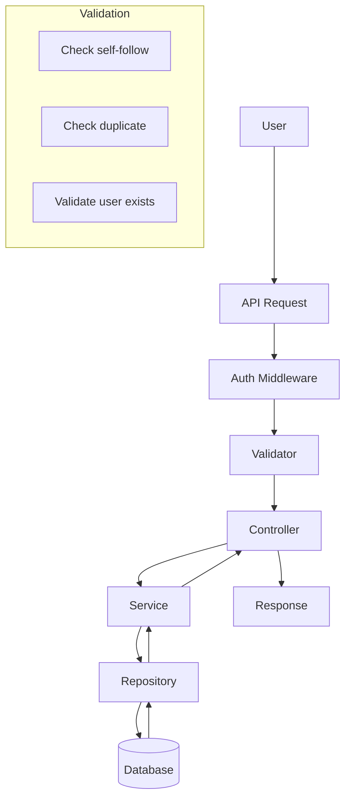

# Circle Feature Implementation Plan

## Overview
The Circle feature allows users to follow each other, similar to Twitter's follow system. Users can add others to their Circle, remove them, and view their Circle members. This feature will be implemented as an extension of the existing `profiles` module.

## Feature Requirements

### Core Capabilities
1. **Add to Circle** - Users can follow others via profiles, posts, or search results
2. **Remove from Circle** - Users can unfollow directly from their Circle list
3. **List Management** - Circle list is accessible from the user's profile
4. **Rules & Validation** - Prevent self-following, duplicate entries, with confirmation for unfollow

### API Endpoints

| Method | Endpoint | Description |
|--------|----------|-------------|
| POST | `/profiles/circle` | Add user to Circle (follow) |
| DELETE | `/profiles/circle/:userId` | Remove user from Circle (unfollow) |
| GET | `/profiles/circle` | Get Circle members list |
| GET | `/profiles/circle/count` | Get Circle members count |
| GET | `/profiles/circle/is-member/:userId` | Check if user is in Circle |

## Database Schema

### New Table: user_connections
```sql
CREATE TABLE IF NOT EXISTS user_connections (
  id VARCHAR PRIMARY KEY DEFAULT LOWER(CAST(uuid_generate_v1mc() As VARCHAR(50))),
  user_id VARCHAR NOT NULL REFERENCES users(id) ON DELETE CASCADE,
  connected_user_id VARCHAR NOT NULL REFERENCES users(id) ON DELETE CASCADE,
  created_at TIMESTAMPTZ DEFAULT NOW(),
  UNIQUE(user_id, connected_user_id)
);

-- Indexes
CREATE INDEX idx_user_connections_user_id ON user_connections(user_id);
CREATE INDEX idx_user_connections_connected_user_id ON user_connections(connected_user_id);
CREATE INDEX idx_user_connections_created_at ON user_connections(created_at DESC);
```

## File Structure Changes

### New Files
- `migrations/sqls/YYYYMMDDHHMMSS-add-circle-table-up.sql`
- `migrations/sqls/YYYYMMDDHHMMSS-add-circle-table-down.sql`

### Updated Files
- `src/modules/profiles/entities.ts` - Add `UserConnectionEntity`
- `src/modules/profiles/dto.ts` - Add DTOs for Circle operations
- `src/modules/profiles/validator.ts` - Add validation schemas
- `src/modules/profiles/query.ts` - Add SQL queries
- `src/modules/profiles/interface.ts` - Add interface methods
- `src/modules/profiles/services.ts` - Add service methods
- `src/modules/profiles/controller.ts` - Add controller methods
- `src/modules/profiles/routes.ts` - Add new routes
- `src/modules/profiles/repositories.ts` - Add repository methods

## Implementation Steps

### Step 1: Database Migration
1. Create new migration files for `user_connections` table
2. Create appropriate indexes

### Step 2: Entity Layer
```typescript
// src/modules/profiles/entities.ts (additions)
export class UserConnectionEntity extends BaseEntity<UserConnectionEntity> {
  id?: string;
  user_id?: string;
  connected_user_id?: string;
  created_at?: Date;
}

export class CircleMemberEntity extends BaseEntity<CircleMemberEntity> {
  id?: string;
  username?: string;
  avatar?: string;
  connected_at?: Date;
}
```

### Step 3: DTO Layer
```typescript
// src/modules/profiles/dto.ts (additions)
export class AddToCircleDTO extends BaseEntity<AddToCircleDTO> {
  user_id: string;
  connected_user_id: string;
}

export class GetCircleMembersDTO extends BaseEntity<GetCircleMembersDTO> {
  user_id: string;
  limit?: number;
  offset?: number;
}

export class RemoveFromCircleDTO extends BaseEntity<RemoveFromCircleDTO> {
  user_id: string;
  connected_user_id: string;
}
```

### Step 4: Validator Layer
```typescript
// src/modules/profiles/validator.ts (additions)
export const addToCircleValidator = Joi.object({
  connected_user_id: Joi.string().required(),
});

export const getCircleMembersValidator = Joi.object({
  limit: Joi.number().min(1).max(100).optional().default(20),
  offset: Joi.number().min(0).optional().default(0),
});

export const unfollowValidator = Joi.object({
  confirm: Joi.boolean().optional().default(false),
});
```

### Step 5: Query Layer
```typescript
// src/modules/profiles/query.ts (additions)
export default {
  // Add to Circle (follow)
  addToCircle: `
    INSERT INTO user_connections (user_id, connected_user_id)
    VALUES ($1, $2)
    ON CONFLICT (user_id, connected_user_id) DO NOTHING
    RETURNING *;
  `,

  // Remove from Circle (unfollow)
  removeFromCircle: `
    DELETE FROM user_connections 
    WHERE user_id = $1 AND connected_user_id = $2;
  `,

  // Get Circle members
  getCircleMembers: `
    SELECT u.id, u.username, u.avatar, uc.created_at as connected_at
    FROM user_connections uc
    JOIN users u ON uc.connected_user_id = u.id
    WHERE uc.user_id = $1
    ORDER BY uc.created_at DESC
    LIMIT $2 OFFSET $3;
  `,

  // Get Circle count
  getCircleCount: `
    SELECT COUNT(*) as total FROM user_connections
    WHERE user_id = $1;
  `,

  // Check if user is in Circle
  isInCircle: `
    SELECT EXISTS(
      SELECT 1 FROM user_connections
      WHERE user_id = $1 AND connected_user_id = $2
    );
  `,

  // Get follower count (users who follow this user)
  getFollowerCount: `
    SELECT COUNT(*) as total FROM user_connections
    WHERE connected_user_id = $1;
  `,
};
```

### Step 6: Interface Layer
```typescript
// src/modules/profiles/interface.ts (additions)
export interface ProfilesInterface {
  // Existing methods...
  
  // Circle methods
  addToCircle(payload: AddToCircleDTO): Promise<BadException | UserConnectionEntity>;
  removeFromCircle(payload: RemoveFromCircleDTO): Promise<BadException | void>;
  getCircleMembers(payload: GetCircleMembersDTO): Promise<BadException | CircleMemberEntity[]>;
  getCircleCount(userId: string): Promise<BadException | number>;
  isInCircle(userId: string, connectedUserId: string): Promise<BadException | boolean>;
  getFollowerCount(userId: string): Promise<BadException | number>;
}
```

### Step 7: Repository Layer
- Implement all methods defined in interface
- Use `db.tx()` for transactional operations
- Handle duplicate entries gracefully
- Return appropriate exceptions

### Step 8: Service Layer
```typescript
// src/modules/profiles/services.ts (additions)
export class ProfilesServiceImpl implements ProfilesInterface {
  // Existing methods...

  public addToCircle = async (
    payload: AddToCircleDTO
  ): Promise<BadException | UserConnectionEntity> => {
    // Validate user is not trying to follow themselves
    if (payload.user_id === payload.connected_user_id) {
      return new BadException('You cannot follow yourself');
    }
    
    // Validate connected user exists
    const userExists = await ProfilesRepository.checkUserExists(payload.connected_user_id);
    if (!userExists) {
      return new NotFoundException('User not found');
    }

    return await ProfilesRepository.addToCircle(payload);
  };

  public removeFromCircle = async (
    payload: RemoveFromCircleDTO
  ): Promise<BadException | void> => {
    return await ProfilesRepository.removeFromCircle(payload);
  };

  public getCircleMembers = async (
    payload: GetCircleMembersDTO
  ): Promise<BadException | CircleMemberEntity[]> => {
    return await ProfilesRepository.getCircleMembers(payload);
  };

  public getCircleCount = async (
    userId: string
  ): Promise<BadException | number> => {
    return await ProfilesRepository.getCircleCount(userId);
  };

  public isInCircle = async (
    userId: string,
    connectedUserId: string
  ): Promise<BadException | boolean> => {
    return await ProfilesRepository.isInCircle(userId, connectedUserId);
  };

  public getFollowerCount = async (
    userId: string
  ): Promise<BadException | number> => {
    return await ProfilesRepository.getFollowerCount(userId);
  };
}
```

### Step 9: Controller Layer
```typescript
// src/modules/profiles/controller.ts (additions)
export class ProfilesController {
  // Existing methods...
  
  public addToCircle: fnRequest = async (req: AuthenticatedRequest, res) => {
    const payload = new AddToCircleDTO();
    payload.user_id = req.user?.id as string;
    payload.connected_user_id = req.body.connected_user_id;
    
    const response = await ProfilesService.addToCircle(payload);
    
    if (response instanceof BadException) {
      logger.error(response.message, 'profiles.controller.ts');
      return ResponseBuilder.error(res, response, response.code);
    }
    
    logger.info('User added to Circle successfully', 'profiles.controller.ts');
    return ResponseBuilder.success(res, 'Added to Circle successfully', StatusCodes.CREATED, response);
  };
  
  public removeFromCircle: fnRequest = async (req: AuthenticatedRequest, res) => {
    const payload = new RemoveFromCircleDTO();
    payload.user_id = req.user?.id as string;
    payload.connected_user_id = req.params.userId;
    
    const response = await ProfilesService.removeFromCircle(payload);
    
    if (response instanceof BadException) {
      logger.error(response.message, 'profiles.controller.ts');
      return ResponseBuilder.error(res, response, response.code);
    }
    
    logger.info('User removed from Circle successfully', 'profiles.controller.ts');
    return ResponseBuilder.success(res, 'Removed from Circle successfully', StatusCodes.OK, response);
  };
  
  public getCircleMembers: fnRequest = async (req: AuthenticatedRequest, res) => {
    const payload = new GetCircleMembersDTO();
    payload.user_id = req.user?.id as string;
    payload.limit = parseInt(req.query.limit as string) || 20;
    payload.offset = parseInt(req.query.offset as string) || 0;
    
    const response = await ProfilesService.getCircleMembers(payload);
    
    if (response instanceof BadException) {
      logger.error(response.message, 'profiles.controller.ts');
      return ResponseBuilder.error(res, response, response.code);
    }
    
    logger.info('Circle members retrieved successfully', 'profiles.controller.ts');
    return ResponseBuilder.success(res, 'Circle members retrieved', StatusCodes.OK, response);
  };
  
  public getCircleCount: fnRequest = async (req: AuthenticatedRequest, res) => {
    const userId = req.user?.id as string;
    const response = await ProfilesService.getCircleCount(userId);
    
    if (response instanceof BadException) {
      logger.error(response.message, 'profiles.controller.ts');
      return ResponseBuilder.error(res, response, response.code);
    }
    
    return ResponseBuilder.success(res, 'Circle count retrieved', StatusCodes.OK, { count: response });
  };
  
  public isInCircle: fnRequest = async (req: AuthenticatedRequest, res) => {
    const userId = req.user?.id as string;
    const connectedUserId = req.params.userId;
    const response = await ProfilesService.isInCircle(userId, connectedUserId);
    
    if (response instanceof BadException) {
      logger.error(response.message, 'profiles.controller.ts');
      return ResponseBuilder.error(res, response, response.code);
    }
    
    return ResponseBuilder.success(res, 'Circle membership checked', StatusCodes.OK, { is_in_circle: response });
  };
}
```

### Step 10: Routes Layer
```typescript
// src/modules/profiles/routes.ts (additions)

/**
 * @swagger
 * /profiles/circle:
 *   post:
 *     summary: Add user to Circle (follow)
 *     tags: [Profiles]
 *     security:
 *       - bearerAuth: []
 *     requestBody:
 *       required: true
 *       content:
 *         application/json:
 *           schema:
 *             type: object
 *             properties:
 *               connected_user_id:
 *                 type: string
 *                 description: ID of user to follow
 *     responses:
 *       201:
 *         description: User added to Circle successfully
 *       400:
 *         description: Cannot follow yourself or already following
 */
profilesRouter.post(
  '/circle',
  verifyAuth,
  validateDataMiddleware(addToCircleValidator, 'body'),
  WatchAsyncController(profilesController.addToCircle)
);

/**
 * @swagger
 * /profiles/circle/{userId}:
 *   delete:
 *     summary: Remove user from Circle (unfollow)
 *     tags: [Profiles]
 *     security:
 *       - bearerAuth: []
 *     parameters:
 *       - name: userId
 *         in: path
 *         required: true
 *         schema:
 *           type: string
 *     responses:
 *       200:
 *         description: User removed from Circle successfully
 */
profilesRouter.delete(
  '/circle/:userId',
  verifyAuth,
  WatchAsyncController(profilesController.removeFromCircle)
);

/**
 * @swagger
 * /profiles/circle:
 *   get:
 *     summary: Get Circle members list
 *     tags: [Profiles]
 *     security:
 *       - bearerAuth: []
 *     parameters:
 *       - name: limit
 *         in: query
 *         schema:
 *           type: number
 *           default: 20
 *       - name: offset
 *         in: query
 *         schema:
 *           type: number
 *           default: 0
 *     responses:
 *       200:
 *         description: Circle members retrieved successfully
 */
profilesRouter.get(
  '/circle',
  verifyAuth,
  validateDataMiddleware(getCircleMembersValidator, 'query'),
  WatchAsyncController(profilesController.getCircleMembers)
);

/**
 * @swagger
 * /profiles/circle/count:
 *   get:
 *     summary: Get Circle members count
 *     tags: [Profiles]
 *     security:
 *       - bearerAuth: []
 *     responses:
 *       200:
 *         description: Circle count retrieved successfully
 */
profilesRouter.get(
  '/circle/count',
  verifyAuth,
  WatchAsyncController(profilesController.getCircleCount)
);

/**
 * @swagger
 * /profiles/circle/is-member/{userId}:
 *   get:
 *     summary: Check if user is in Circle
 *     tags: [Profiles]
 *     security:
 *       - bearerAuth: []
 *     parameters:
 *       - name: userId
 *         in: path
 *         required: true
 *         schema:
 *           type: string
 *     responses:
 *       200:
 *         description: Circle membership checked
 */
profilesRouter.get(
  '/circle/is-member/:userId',
  verifyAuth,
  WatchAsyncController(profilesController.isInCircle)
);
```

## Validation Rules
1. **Self-following**: Users cannot follow themselves
2. **Duplicate entries**: Prevent duplicate entries with `ON CONFLICT` in SQL
3. **User existence**: Validate that the connected user exists before following
4. **Confirmation**: Optional - require confirmation before unfollowing (via query param)

## Error Handling
| Error Code | Error Type | Scenario |
|------------|------------|----------|
| 400 | BadException | User trying to follow themselves |
| 400 | BadException | Invalid user ID format |
| 404 | NotFoundException | Connected user does not exist |
| 409 | ConflictException | User already in Circle |

## Mermaid Diagram - Data Flow



## Testing Strategy

### Unit Tests
1. Service layer tests for business logic
2. Validator tests for input validation
3. Controller tests for request/response handling

### Integration Tests
1. Database operations
2. API endpoint responses
3. Auth middleware integration
